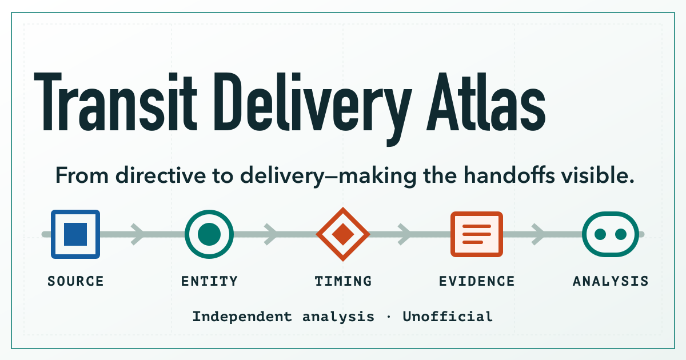

# Transit Delivery Atlas

> From directive to delivery—making the handoffs visible.



**Project links**

- Live site: [transit.chelseakr.com](https://transit.chelseakr.com)
- Source repository: [github.com/ChelseaKR/transit-delivery-atlas](https://github.com/ChelseaKR/transit-delivery-atlas)

**Transit Delivery Atlas** is an independent, source-linked crosswalk for
California Executive Order N-7-26. It turns each actionable directive into a
navigable record of source language, explicitly named entities, timing,
analytical dependencies, expected outputs, and open implementation questions.

> [!IMPORTANT]
> This is independent public-interest analysis, not an official State of
> California website. It is not affiliated with or endorsed by the State of
> California or any state or local agency. Analytical labels are not official
> implementation statuses or legal conclusions.

## What this is

- A structured reading of the signed executive order
- A traceable separation between source language and analysis
- A public dataset with section locators, review dates, and stable identifiers
- A way to surface delivery questions that the primary source does not answer

## What this is not

- An official implementation or accountability dashboard
- A determination of legal compliance or agency performance
- Evidence that work has or has not occurred outside the public record
- A geographic map, transit-feed validator, or reporting automation system

## Primary sources

- [Executive Order N-7-26 — signed PDF](https://www.gov.ca.gov/wp-content/uploads/2026/06/ATTESTED_6.26-Transit-EO_FINAL_SIGNED.pdf)
- [Official announcement and summary](https://www.gov.ca.gov/2026/06/26/governor-newsom-signs-executive-order-to-accelerate-new-technologies-and-services-for-californias-local-transit-and-passenger-rail-networks-throughout-the-state/)

The signed order controls when summaries differ. Every analytical record is
stored separately from the source extraction and labeled as interpretation.

## Explore the data

The canonical data lives in `data/`. Build-time exports are published as JSON
and CSV under `public/data/`.

- `sources.json` records the official source, dates, retrieval date, and hash
- `organizations.json` provides stable identifiers for explicitly named bodies
- `directives.json` contains the 21 actionable directive units in document order
- `analysis.json` contains plain-language summaries, themes, inferred outputs,
  dependencies, and open questions

See [the methodology](docs/METHODOLOGY.md) and [product specification](docs/PRD.md)
for the classification model, acceptance criteria, and known limitations.

## Local development

Requires Node.js 22.13 or newer.

```bash
npm install
npm run dev
```

Before proposing a change:

```bash
npm run check
```

## Corrections and contributions

Corrections should identify the directive ID, official source, section or page
locator, and the proposed change. A correction to a source record must never be
mixed silently with a change to analytical interpretation.

See [CONTRIBUTING.md](CONTRIBUTING.md) for the review and validation workflow.

## Accessibility

The project targets WCAG 2.2 Level AA and is being evaluated against the
web-content requirements of the Revised Section 508 Standards. The Revised 508
Standards incorporate WCAG 2.0 Level A and AA; the WCAG 2.2 target adds newer
success criteria without replacing 508-specific scoping and functional review.

This independent site is not represented as a federal system or as legally
certified. California Government Code §7405 requires state governmental entities
developing, procuring, maintaining, or using information technology to comply
with Section 508 requirements, which makes 508 readiness relevant to the
project's intended context.

- [Section 508 web-content overview](https://www.section508.gov/test/websites/)
- [California Government Code §7405](https://leginfo.legislature.ca.gov/faces/codes_displaySection.xhtml?lawCode=GOV&sectionNum=7405)
- [Accessibility approach and current test scope](docs/ACCESSIBILITY.md)

Static checks, rendered-HTML assertions, representative automated scans, and
programmatic spot checks are complete on the current development build. Full
cross-browser keyboard, screen-reader, zoom, forced-colors, and disabled-user
evaluation remains pending. These checks are quality controls, not an
accessibility certification or a conformance claim.

## Licensing

- Code: [MIT](LICENSE)
- Original structured analysis and documentation: [CC BY 4.0](CONTENT-LICENSE.md)
- Government source documents and quoted material remain subject to their own
  terms and are not relicensed by this project
