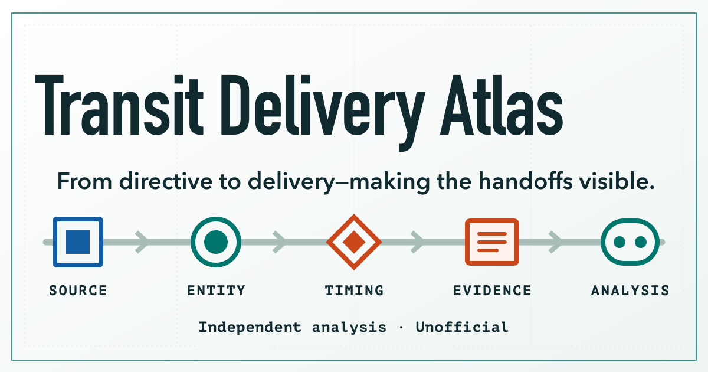

# Transit Delivery Atlas

> From directive to delivery—making the handoffs visible.



**Project links**

- Live site: [transit.chelseakr.com](https://transit.chelseakr.com)
- Relationship view: [transit.chelseakr.com/handoffs](https://transit.chelseakr.com/handoffs)
- Context watchlist: [transit.chelseakr.com/watchlist](https://transit.chelseakr.com/watchlist)
- TDA/NTD research: [transit.chelseakr.com/research/tda-ntd](https://transit.chelseakr.com/research/tda-ntd)
- Source repository: [github.com/ChelseaKR/transit-delivery-atlas](https://github.com/ChelseaKR/transit-delivery-atlas)

**Transit Delivery Atlas** is an independent, source-linked crosswalk for
California Executive Order N-7-26. It turns each actionable directive into a
navigable record of source language, explicitly named entities, timing,
public-evidence coverage (including explicit empty states), analytical
dependencies, expected outputs, open implementation questions, and a separate
context watchlist for relevant official developments that do not yet qualify as
evidence.

> [!IMPORTANT]
> This is independent public-interest analysis, not an official State of
> California website. It is not affiliated with or endorsed by the State of
> California or any state or local agency. Analytical labels are not official
> implementation statuses or legal conclusions.

## Quickstart

Requires Node.js 22.13 or newer.

```bash
npm install
npm run dev
```

Before proposing a change:

```bash
npm run check
```

## What this is

- A structured reading of the signed executive order
- A traceable separation among source language, reviewed public evidence,
  context-only research leads, and analysis
- A public dataset with section locators, review dates, and stable identifiers
- A relationship index separating explicitly named bodies from inferred
  cross-directive links
- A way to surface delivery questions that the primary source does not answer

## What this is not

- An official implementation or accountability dashboard
- A determination of legal compliance or agency performance
- Evidence that work has or has not occurred outside the public record
- A comprehensive or live catalog of implementation activity
- A geographic map, transit-feed validator, or reporting automation system
- An official workflow, responsibility matrix, critical path, or interagency
  handoff record

## Primary sources

- [Executive Order N-7-26 — signed PDF](https://www.gov.ca.gov/wp-content/uploads/2026/06/ATTESTED_6.26-Transit-EO_FINAL_SIGNED.pdf)
- [Official announcement and summary](https://www.gov.ca.gov/2026/06/26/governor-newsom-signs-executive-order-to-accelerate-new-technologies-and-services-for-californias-local-transit-and-passenger-rail-networks-throughout-the-state/)

The signed order controls when summaries differ. Every analytical record is
stored separately from the source extraction and labeled as interpretation.

## Explore the data

The canonical data lives in `data/`. Build-time exports are published as JSON
and CSV under `public/data/`.

- `sources.json` records the official source, dates, retrieval date, and hash
- `organizations.json` provides stable identifiers for explicitly named bodies
- `directives.json` contains the 21 actionable directive units in document order
- `analysis.json` contains plain-language summaries, themes, inferred outputs,
  dependencies, and open questions
- `evidence.json` contains a selective collection of dated public artifacts,
  exact directive citations, locators, hashes, review dates, and limitations
- `watchlist.json` contains a separate selective collection of official context
  sources and publication checkpoints, editorial relevance links,
  evidence-boundary notes, and planned review dates
- `tda-ntd-feasibility.json` contains the cited four-field reporting research,
  feasibility classes, controls, and remaining evidence needs

The first reporting slice compares passenger boardings, vehicle revenue miles,
vehicle revenue hours, and operating expense across the State Controller's
Transit Operator Financial Transactions Report and FTA's reduced-reporting
framework. It supports assisted preparation and reconciliation—not automated
certification or filing. The accompanying [expert review guide](docs/EXPERT_REVIEW_GUIDE.md)
provides a repeatable usability and domain-review script.

Readers can [suggest a source-backed correction or share structured review
feedback](https://transit.chelseakr.com/corrections/). Public submissions must
exclude confidential records, personal data, credentials, and security details.

The public JSON keeps those layers separate. `directives.csv` contains the
source/analysis crosswalk, while `evidence.csv` contains the public-artifact
records and their explicit directive relationships.
The context watchlist has an independent `watchlist.json`, `watchlist.csv`, and
JSON Schema contract; it does not contribute to evidence counts.
`directive-organizations.csv` normalizes the 50 source-role links, and
`directive-relationships.csv` normalizes the 27 inferred cross-references.
The latter preserves analytical-record provenance without asserting workflow
direction. Omission from the evidence collection does not show that no
activity or public record exists; inclusion does not establish completion,
compliance, or performance.

See [the methodology](docs/METHODOLOGY.md),
[relationship model](docs/RELATIONSHIP-MODEL.md),
[evidence model](docs/EVIDENCE-MODEL.md),
[watchlist model](docs/WATCHLIST-MODEL.md), and
[product specification](docs/PRD.md) for the classification model, acceptance
criteria, and known limitations.

## Corrections and contributions

Corrections should identify the directive, evidence, or watchlist ID; public
source; section, page locator, or evidence-boundary statement; and the proposed
change. Source, evidence, watchlist, and analytical changes are reviewed
separately and must never be mixed silently.

See [CONTRIBUTING.md](CONTRIBUTING.md) for the review and validation workflow.

## Accessibility

The project targets WCAG 2.2 Level AA and is being evaluated against the
web-content requirements of the Revised Section 508 Standards. The Revised 508
Standards incorporate WCAG 2.0 Level A and AA; the WCAG 2.2 target adds newer
success criteria without replacing 508-specific scoping and functional review.

This independent site is not represented as a federal system or as legally
certified. California Government Code §7405 requires state governmental entities
developing, procuring, maintaining, or using information technology to comply
with Section 508 requirements, which makes 508 readiness relevant to the
project's intended context.

- [Section 508 web-content overview](https://www.section508.gov/test/websites/)
- [California Government Code §7405](https://leginfo.legislature.ca.gov/faces/codes_displaySection.xhtml?lawCode=GOV&sectionNum=7405)
- [Accessibility approach and current test scope](docs/ACCESSIBILITY.md)

The last manual accessibility review was on **2026-07-13, at commit `ef1d11b`**,
and covered the routes that existed then. Lint, canonical-data validation and
rendered-HTML assertions still run on every build; the representative-route
scans and spot checks from that review were a one-off and are not reproducible.

`/research/tda-ntd`, `/corrections` and `/watchlist`, the watchlist disclosure
pattern, the print control, the URL-syncing filters, and the 2026-07-22 register
redesign shipped after that review and are **not** covered by it. That is a
statement about evaluation coverage, not a finding about those surfaces. Full
cross-browser keyboard, screen-reader, zoom, forced-colors, and disabled-user
evaluation remains pending. These checks are quality controls, not an
accessibility certification or a conformance claim. See
[docs/ACCESSIBILITY.md](docs/ACCESSIBILITY.md) for the dated scope.

## Standards Conformance

Transit Delivery Atlas is developed against a shared set of portfolio
engineering standards. Applicability and current state:

| Standard | Applies? | State |
|---|---|---|
| Responsible-Tech Framework | Applies | Independent-analysis posture, correction workflow, and explicit non-affiliation labeling (see "What this is not") |
| Code Quality | Applies | ESLint + strict TypeScript typecheck, fail-closed data validation; gated in CI (`npm run check`) |
| Security & Supply-Chain | Applies | CodeQL SAST, TruffleHog full-history secret scan, Dependabot, npm production audit, SHA-pinned actions, SECURITY.md |
| CI/CD | Applies | Quality gate on every push/PR; OIDC-based deploy with post-deploy smoke checks (`.github/workflows/`) |
| Observability | Applies | Static site: build SHA published at `/version.json`; deploy workflow smoke-verifies the exact released SHA and security headers |
| Accessibility | Applies | WCAG 2.2 AA target with Section 508 framing; rendered-HTML test assertions on every build; last manual review dated 2026-07-13 at `ef1d11b`, with the routes and patterns shipped since listed as uncovered (docs/ACCESSIBILITY.md) |
| Internationalization | Applies | English-only today; owner, first localization boundary, source-language rule, fallback, and review deadline are declared in [`docs/I18N.md`](docs/I18N.md) |
| AI Evaluation | N/A — source-linked deterministic site; no LLM/model component | N/A — no generative or model-driven component anywhere in the build or site |
| Documentation | Applies | README, methodology/evidence/relationship models, ADR log (docs/adr/), CHANGELOG, CONTRIBUTING |
| Quality & Metrics | Applies | Data-integrity, filter, rendered-HTML, and hosting test suites run in the release gate |
| Release & Versioning | Applies | CHANGELOG (Keep-a-Changelog), semver in package.json, tag-triggered release workflow re-runs the full gate at the tagged commit |

## Licensing

- Code: [Apache-2.0](LICENSE)
- Original structured analysis and documentation: [CC BY 4.0](CONTENT-LICENSE.md)
- Government source documents and quoted material remain subject to their own
  terms and are not relicensed by this project

## Support

This is independent, unpaid work. If it has been useful to you, you can
<a href='https://ko-fi.com/T6T6GMYTU' target='_blank'></a>
